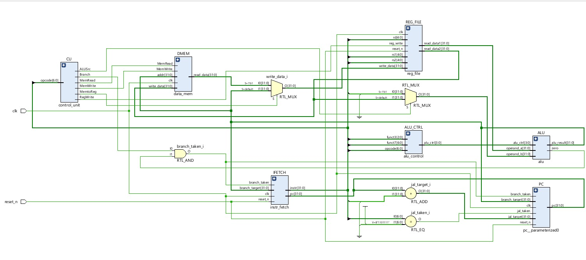

# riscv-cpu-with-clock-gating
🟢 "🚀 RISC-V CPU | 5-Stage Pipeline | Clock Gating | Low Power | SystemVerilog | FPGA Ready ⚡"

# RISC-V CPU (SystemVerilog)

This is a simple **RISC-V CPU** implemented in **SystemVerilog**.  
It includes a **5-stage pipeline** and **clock gating** for low-power operation.

## 📂 Files
- **`src/`** → Contains all SystemVerilog source files
- **`tb/`** → Contains testbench files

## 🚀 How to Run
1. Use **Vivado, ModelSim, or Icarus Verilog** for simulation.  
2. Compile the design and testbench.

## 📷 Circuit Schematic  

### 🔹 What is Clock Gating?  
Clock gating is a **power-saving technique** used in digital circuits to disable the clock signal for **inactive components**, reducing dynamic power consumption. Instead of continuously toggling unused flip-flops and registers, clock gating **stops the clock when a circuit is not in use**, saving energy.

### 🔹 How We Implemented Clock Gating  
In this RISC-V CPU design, clock gating is applied to **registers and pipeline stages** to reduce switching power:  
✅ A **clock gating cell** is inserted before registers that do not need frequent updates.  
✅ **Enable signals** dynamically control when clock pulses are passed to pipeline registers.  
✅ **If a stage has no new data, the clock signal is disabled**, reducing unnecessary transitions.  

By incorporating **clock gating**, this design achieves **lower power consumption** while maintaining the performance of a fully functional **5-stage pipelined RISC-V CPU**.
